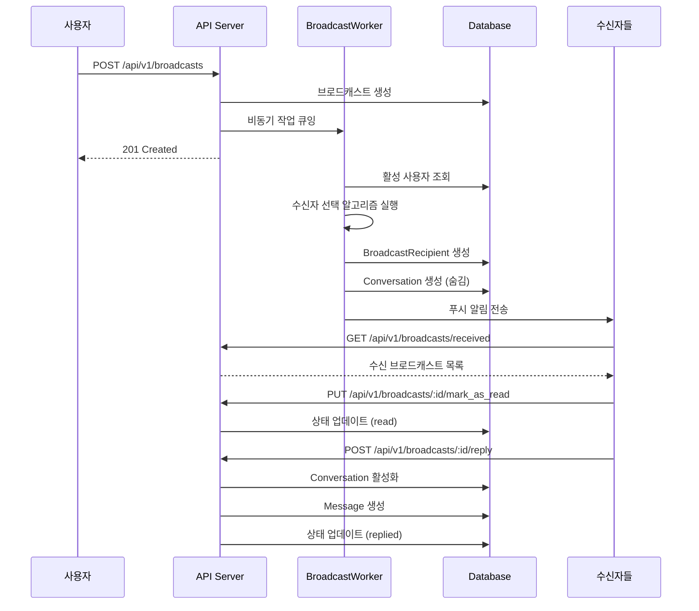

# Talkk 브로드캐스트 시스템 아키텍처

## 개요

Talkk의 브로드캐스트 시스템은 사용자가 1~30초 오디오 메시지를 여러 사용자에게 동시에 전송할 수 있는 기능입니다. 수신자는 지능형 알고리즘에 의해 자동으로 선택됩니다.

## 시스템 구성요소

### 1. 데이터 모델

```ruby
# 브로드캐스트 모델 관계도
Broadcast
  ├── has_many :broadcast_recipients
  ├── has_many :recipients (through: :broadcast_recipients)
  ├── has_many :conversations
  └── belongs_to :user (sender)

BroadcastRecipient
  ├── belongs_to :broadcast
  ├── belongs_to :recipient (User)
  └── status: [:delivered, :read, :replied]

Conversation
  ├── belongs_to :broadcast (optional)
  ├── has_many :messages
  └── has_many :users (sender + recipient)
```

### 2. 워크플로우



### 3. 수신자 선택 알고리즘

#### 3.1 기본 필터링
- 활성 상태 사용자 (`status: active`)
- 전화번호가 있는 사용자
- 차단 관계가 없는 사용자
- 최근 30일 이내 로그인한 사용자

#### 3.2 점수 계산 요소

| 요소 | 가중치 | 설명 |
|------|--------|------|
| 응답률 | 25% | 과거 브로드캐스트에 대한 응답 비율 |
| 상호작용 | 25% | 최근 대화 활동 빈도 |
| 선호도 | 20% | 성별, 연령대, 지역 매칭 |
| 활동도 | 30% | 최근 로그인 및 앱 사용 빈도 |

#### 3.3 다양성 보장
- 24시간 이내 브로드캐스트 수신자 중 50%는 제외
- 상위 20%는 항상 포함, 나머지는 확률적 선택

### 4. 주요 API 엔드포인트

| 메서드 | 경로 | 설명 |
|--------|------|------|
| GET | `/api/v1/broadcasts` | 내가 보낸 브로드캐스트 목록 |
| POST | `/api/v1/broadcasts` | 새 브로드캐스트 생성 |
| GET | `/api/v1/broadcasts/received` | 내가 받은 브로드캐스트 목록 |
| GET | `/api/v1/broadcasts/:id` | 브로드캐스트 상세 정보 |
| PUT | `/api/v1/broadcasts/:id/mark_as_read` | 읽음 처리 |
| POST | `/api/v1/broadcasts/:id/reply` | 답장하기 |

### 5. 성능 최적화

#### 5.1 비동기 처리
- 브로드캐스트 생성 즉시 응답
- Sidekiq을 통한 백그라운드 수신자 선택

#### 5.2 쿼리 최적화
```ruby
# N+1 문제 방지
broadcasts.includes(:user, :broadcast_recipients)

# 인덱스 활용
add_index :broadcast_recipients, [:recipient_id, :created_at]
add_index :broadcasts, [:created_at, :status]
```

#### 5.3 캐싱 전략
- 사용자 활동 점수 Redis 캐싱 (TTL: 1시간)
- 브로드캐스트 목록 캐싱 (TTL: 5분)

### 6. 보안 고려사항

- JWT 토큰 기반 인증
- 수신자만 브로드캐스트 내용 접근 가능
- 차단된 사용자 간 통신 방지
- Rate limiting: 시간당 10개 브로드캐스트 제한

### 7. 모니터링 지표

- 브로드캐스트 전송 성공률
- 평균 응답률 (읽음/답장)
- 수신자 선택 알고리즘 효율성
- API 응답 시간

### 8. 향후 개선 계획

1. **ML 기반 수신자 추천**: 사용자 행동 패턴 학습
2. **실시간 알림**: WebSocket 기반 실시간 업데이트
3. **그룹 타겟팅**: 특정 그룹에게만 브로드캐스트
4. **예약 발송**: 특정 시간에 자동 발송
5. **A/B 테스팅**: 다양한 수신자 선택 전략 테스트
